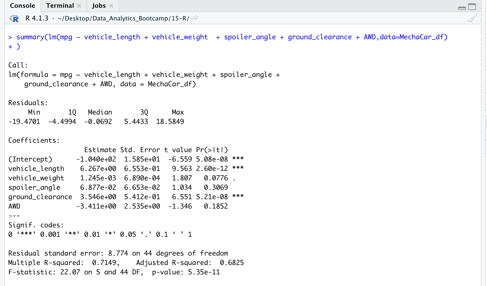
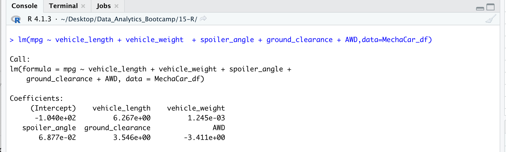
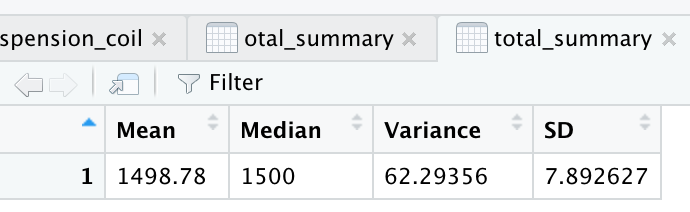
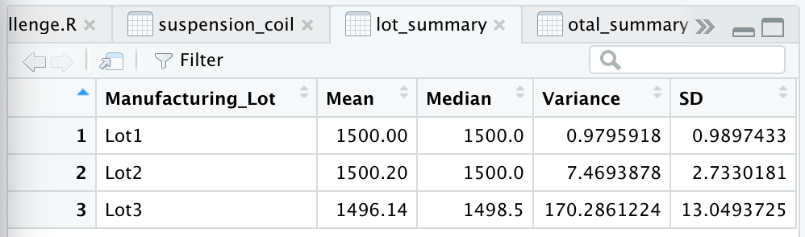
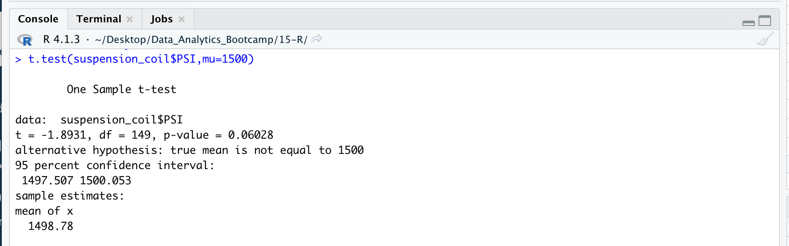
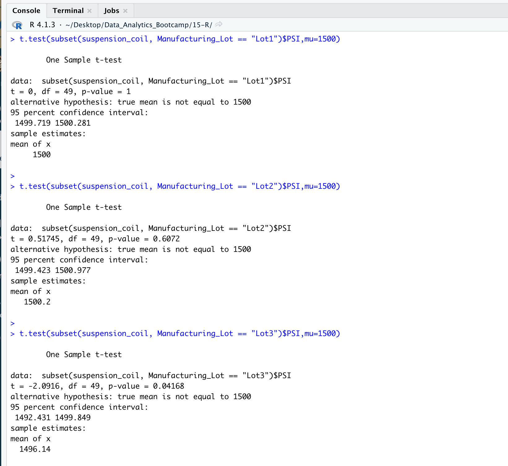

# MechaCar Statistical Analysis

### Linear Regression to Predict MPG

##### Results:

Linear Regression:

Statistical summary of the linear regression model with the  p-values and r-squared value:

##### Interpretation:

- Which variables/coefficients provided a non-random amount of variance to the mpg values in the dataset?

  - Intercept (mpg itself)
  - vehicle_length
  - ground_clearance

- Is the slope of the linear model considered to be zero? Why or why not?

  The slope of this linear model is not considered to be zero, because there is a significant linear relationship between some of the independent variables (vehicle length, ground clearance, and mpg itself) and the dependent variable (mpg). 

- Does this linear model predict mpg of MechaCar prototypes effectively? Why or why not?

  The effectiveness of this linear model in predicting mpg of MechaCar is inconclusive. 

  Vehicle length and ground clearance variables do show to have a significant impact on mpg of MechaCar prototypes. And mpg itself also proved significant in this model. 

  The significance of the intercept in this case could mean that the significant features (vehicle length and ground clearance) may need scaling or transforming to help improve the predictive power of the model. 

  As fuel economy is an important performance feature in prototyping cars, more data needs to be analyzed. Either additional metrics need to be included, or more prototypes need to be tested; or both. 

  In other words, in order to improve the predictive power of the linear model, we may need to change the independent variables and/or transform them, increase the sample size, and then re-evaluate our coefficients and significance.

  

### Summary Statistics on Suspension Coils

- Does the current manufacturing data meet this design specification for all manufacturing lots in total and each lot individually? Why or why not?

  - In total, the manufacturing lots do meet the design specifications.The variance of PSI of the suspension coils of the entire dataset (all vehicles) is 62.29356, as can be seen in the screenshot of the data frame below:

    

    

  - Performing the summary on each lot individually, new numbers were revealed that are important in the process of determining whether the manufacturing process is consistent across all production lots.

    The discrepancies skewed the total, giving an impression that the total variance of PSI across all lots would have met the specifications, when examined as a group.

    This revealed the importance of assessing summary statistics on the individual lots in additional to the total, to paint a clearer picture of the data and allow for a more effective evaluation of the production standards.

    We can see in this screenshot that in Lot1 and Lot2 the variance of PSI was indeed lower than the specifications, while in Lot3 the variance exceeded the maximum variance specifications of 100 pounds per inch by a lot, showing a clear inconsistency in production amongst the various lots:

### T-Tests on Suspension Coils

#### Technical Analysis

- Determine if the PSI across all manufacturing lots is statistically different from the population mean of 1,500 pounds per square inch.

  

  On the first t-test, with the statistics of PSI across all manufacturing lots in the dataset being tested against the presumed population mean of 1,500 pounds per square inch, our p-value falls on the cusp, only slightly above the significance level, assuming our significance level cutoff as the default of 0.05.

  Based on this test, we don't reject the null hypothesis, and we conclude that there's no statistical difference between the means.

  We would need to look further and perform different kinds of analysis to understand the results more in-depth.

  

- Determine if the PSI for each manufacturing lot is statistically different from the population mean of 1,500 pounds per square inch.

  

  When seen separately, the T-tests of each subset of the data look different than when tested the mean PSI of the dataset as a whole, still assuming our cutoff for significance level as the default 0.05 percent. 

  - Manufacturing Lot 1 shows a p-value of 1, which is pronouncedly larger than the cutoff for significance level.
  - Manufacturing Lot 2 shows a p-value of 0.6072, which is larger than the cutoff for significance level.
  - Manufacturing Lot 3 shows a p-value of 0.04168, which is less than the cutoff for significance level.

  The T-tests of Manufacturing Lots 1 and 2 will lead us to not reject the null hypothesis, and determine that there is no statistical difference between the observed sample means and the presumed population mean. 

  The T-test of Manufacturing Lot 3 will lead us to reject the null hypothesis, determining that the mean of that sample and the presumed population mean are statistically different.

  We can conclude that the T-test done in each Manufacturing Lot separately revealed results that are more specific, which will be relevant in further assessing the efficiency of the production standards of suspension coils.

### Study Design: MechaCar vs Competition

A statistical study design to compare performance of MechaCar  Vehicles against the performance of other vehicle manufacturers will entail quantifying how MechaCar designs perform against competitors' designs. 

In order to properly assess the general comparison, we need to begin by investigating what are the main questions that drive customers to select their preferred brand. The most logical first step would be to perform consumer-based research, collecting data about consumer behavior.

For speculative purposes, and to begin to sketch out a statistical study design that would help the technical team build better and more competitive cars, we will presume arbitrarily which metrics might be relevant to use when gauging how MechaCar compares to its competition for the average automobile consumer.

- What metric or metrics are you going to test?

  To initialize our study, these would be important general metrics to test:

  - Fuel efficiency
  - Maintenance cost
  - Cost to purchase
  - Residual value 
  - Safety and Technology Features
  - Safety Rating

- What is the null hypothesis or alternative hypothesis?

  - Null Hypothesis = H0 = There is no difference between MechaCar and its main competitors in each of the metrics above
  - Alternative Hypothesis = HA = There is a significant difference  between MechaCar and its main competitors in each of the metrics above

- What statistical test would you use to test the hypothesis? And why?

  The first statistical test to use would be the T-test. The T-test is a good way to make a first assessment of the basic comparison between the datasets in each of the pre-determined metrics. 

  - We would pinpoint two or three main competitors and collect data on the metrics in question
  - For each metric, we would apply the T-test comparing MechaCar to each alternative brand using the main feature or features that pertain to that metric. In order to find out which features are most relevant to the respective metrics we would work closely with our engineering and design team.
  - Any time H0 is rejected, that means the T-test will have indicated that there is a significant difference in that particular metric.
  - If a particular T-test is consistently returning a significant difference throughout the brand comparisons, that's a good indication that such metrics should be the one to begin investigating further.

- What data is needed to run the statistical test?

  In order to run the statistical tests, we will need comprehensive data on various features related to the metrics that we are testing. Once we narrow the focus us of our study, we can perform more in-depth analysis using Simple and Multiple Linear Regressions to map out the distribution of each dataset and make comparisons.

  As we go, we can return and re-evaluate the initial metrics, we can collect more data to substantiate and verify findings in finer levels of sensitivity, depending largely on the metrics in question. For Safety Features and Safety Ratings, for instance we may need to have less tolerance for false results than, say, residual value.  We can also create subsets of data, perform T-tests or chi-squared tests and find out more quickly and efficiently where to begin refining the studies.
